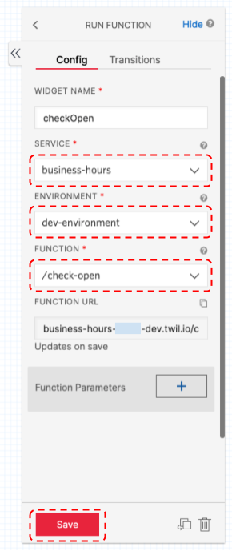

# 営業日判定 for Twilio Studio

Twilio Studio から営業時間内かをどうかを判定します。  
事前に設定した営業曜日（月〜日）、営業時間、祝日営業の３つを判定します。

## 準備

以下の準備が必要です。

- [Twilio アカウント](https://cloudapi.kddi-web.com/signup)
- [Twilio CLI](https://qiita.com/mobilebiz/items/456ce8b455f6aa84cc1e)
- [Twilio CLI サーバーレスプラグイン](https://qiita.com/mobilebiz/items/fb4439bf162098e345ae)

## インストール方法

```sh
git clone https://github.com/mobilebiz/business-hours.git
cd business-hours
npm install
```

## 環境変数の設定

```sh
cp .env.sample .env
```

コピーした`.env`をエディタで開き、以下の項目を設定します。

| 項目        | 設定内容                |
| :---------- | :---------------------- |
| ACCOUNT_SID | Twilio のアカウント SID |
| AUTH_TOKEN  | 上記に対する AuthToken  |

## 営業日の設定

エディタで、`functions/check-open.js`を開きます。  
以下の部分が営業日の設定になりますので、コメントを見ながら適宜編集してください。

```javascript
// 営業日、営業時間の設定
const BUSINESS_HOURS = {
  dayOfWeek: ["月", "火", "水", "木", "金", "土", "日"], // 営業日を記述、休業日は削除（例： ["月", "火", "水"]）
  startTime: "9:00", // 営業開始時間を24時間表記で指定
  endTime: "18:00", // 営業終了時間を24時間表記で指定
  holiday: true, // 祝日営業するならtrue
};
```

## デプロイ

デプロイするときは、Twilio CLI プロファイルが対象の Twilio プロジェクトのものであることを確認してください。
違うプロファイルでデプロイをすると、間違ったプロジェクト内に Functions ができてしまいます。プロファイルを切り替えるときは、twilio profiles:use プロファイル名で行います。

以下のコマンドでデプロイします。

```sh
npm run deploy
```

## Studio からの呼び出し

以下のコマンドを使うとサンプルの Studio Flow がインストールされます。

```sh
twilio api:studio:v2:flows:create --friendly-name 'BusinessHours' --status published --definition "`cat ./studio/BusinessHours.json`"
```

- Twilio 管理コンソールにログインし、Studio メニューを開きます。
- 今作成された`BusinessHours`という名前のフローを開きます。
- `checkOpen`ウィジェットを選択し、**SERVICE**プルダウンから、`business-hours`を選択します。
- **ENVIRONMENT**プルダウンから、`dev-environment`を選択します。
- **FUNCTION**プルダウンから、`/check-open`を選択します。
- **Save**ボタンを押して保存します。
- 画面上部にある**Publish**ボタンを押して、フローをパブリッシュします。



以上でフローは完成です。

## テスト

購入済みの Twilio 番号に、上記のフローを割り当ててテストしてください。  
営業時間外の場合は、その旨のガイダンスが流れます。営業時間内の場合は、コールはキューに入ります（発信者には音楽が聞こえます）。  
必要に応じて、最後の`Enqueue`ウィジェットを、**Connect Call To**ウィジェットなどに変更してください。

## 謝辞

祝日判定には、[こちら](http://s-proj.com/utils/holiday.html)の API を利用させていただいております。

## 免責事項

本プログラムの動作についての保証はいたしませんので、自己責任の範疇でご利用ください。
